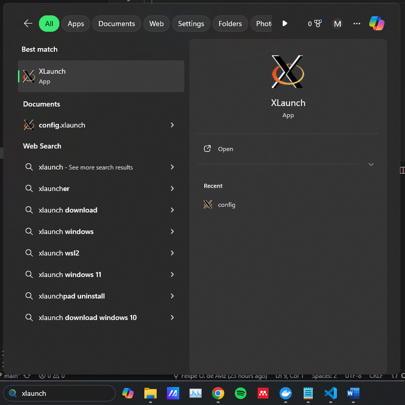
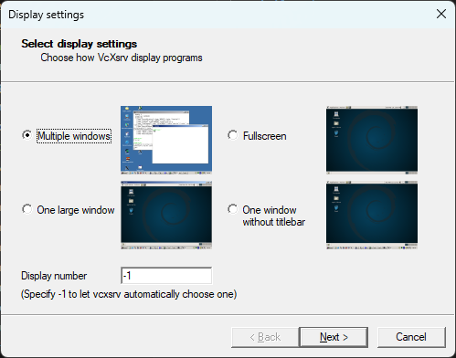
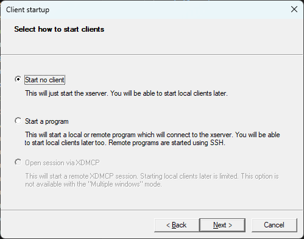
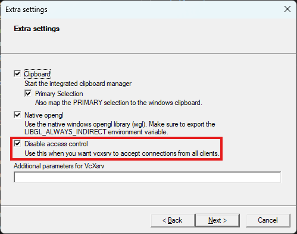
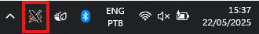
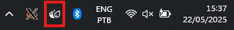
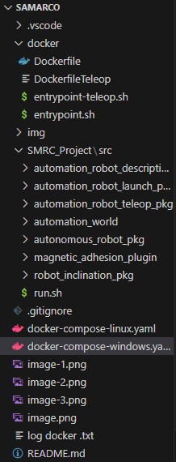
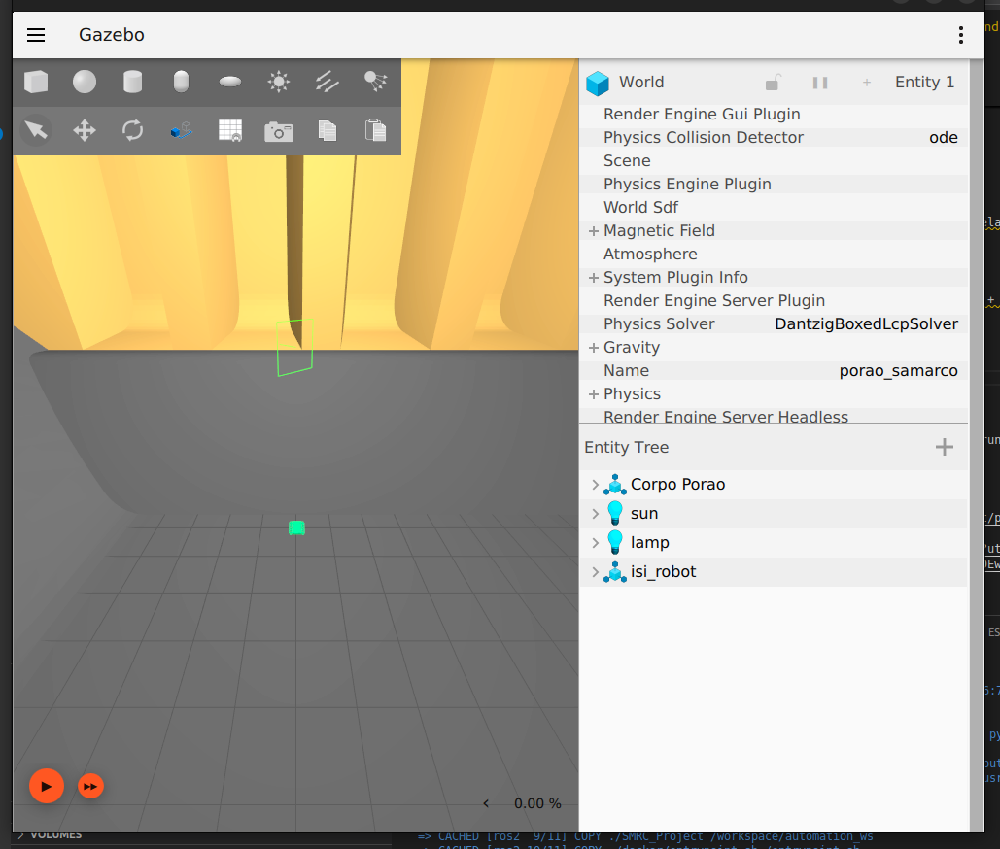
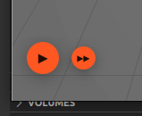
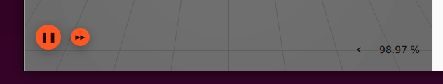

# Samarco

## Versões dos componentes

- Ubuntu 22.04.5 LTS (Jammy Jellyfish)
- ROS Humble
- Gazebo Fortress (Gazebo Sim 6.17.0)
- Docker Engine

## Requisitos

### Computadores Windows

1. VcXsrv (Servidor de janelas X11 para Windows)
<https://sourceforge.net/projects/vcxsrv/files/latest/download>

2. Docker Desktop 
<https://desktop.docker.com/win/main/amd64/Docker%20Desktop%20Installer.exe?utm_source=docker&utm_medium=webreferral&utm_campaign=dd-smartbutton&utm_location=module&_gl=1*eajb5i*_gcl_au*MTI3NDAwNTYyOC4xNzQyODMwNDkz*_ga*MTA2Mjc4NDM5NS4xNzQyNDEwNDUx*_ga_XJWPQMJYHQ*MTc0MjgzMDQ5My4xMS4xLjE3NDI4MzA1NzQuNDYuMC4w>

### Computadores LINUX

1. Docker Desktop 
<https://desktop.docker.com/win/main/amd64/Docker%20Desktop%20Installer.exe?utm_source=docker&utm_medium=webreferral&utm_campaign=dd-smartbutton&utm_location=module&_gl=1*eajb5i*_gcl_au*MTI3NDAwNTYyOC4xNzQyODMwNDkz*_ga*MTA2Mjc4NDM5NS4xNzQyNDEwNDUx*_ga_XJWPQMJYHQ*MTc0MjgzMDQ5My4xMS4xLjE3NDI4MzA1NzQuNDYuMC4w>

## Como executar o projeto

### Computadores Windows

1. Copie a pasta do projeto para o seu computador

2. Executar o servidor de janelas X11, através do aplicativo Xlaunch <br>


3. Utilizar as seguintes configurações para o Xlaunch<br>




4. O programa irá aparecer rodando na área de notificação da barra de tarefas<br>


5. Executar o docker

6. O programa irá aparecer rodando na área de notificação da barra de tarefas <br>


7. Abrir o Visual Studio Code

8. Abrir a pasta do projeto através de *File > Open Folder...* o que resultará na seguinte arvore de projeto <br>


9. Botão direito no file README.md e *Open Preview* irá abrir o tutorial no Visual Studio

10. Abrir um novo terminal através de *Terminal > New Terminal*

11. Com o terminal na pasta do projeto, executar o comando para rodar o container ROS2 + Gazebo
```
docker compose -f docker-compose-windows.yaml up --build -d
```
12. Aguarde alguns segundos e deve aparecer uma notificação, como imagem abaixo <br>
<br>
e mais alguns segundos deve surgir a tela do Gazebo Fortress:<br>


13. Executar a simulação através do botão "PLAY" no canto inferior esquerdo da janela do Gazebo <br>


14. A simulação estará rodando quando o contador de frames estará se atualizando <br>


15. Inicie o teleoperacional para controlar o rodo com o comando abaixo no terminal
```
sudo docker container exec -it samarco-ros2-1 /workspace/automation_ws/src/run.sh
```

### Computadores Linux

1. Em um novo terminal executar o comando necessario para liberar conexão ao gerenciador de janelas X11 no seu computador
```
xhost +local:root
```
2. Com o terminal na pasta do projeto, executar o comando para rodar o container ROS2 + Gazebo
```
sudo docker compose -f docker-compose-linux.yaml up --build -d
```
3. Aguarde alguns segundos e deve aparecer uma notificação, como imagem abaixo <br>
<br>
e mais alguns segundos deve surgir a tela do Gazebo Fortress:<br>


4. Executar a simulação através do botão "PLAY" no canto inferior esquerdo da janela do Gazebo <br>


5. A simulação estará rodando quando o contador de frames estará se atualizando <br>


6. Em um novo terminal na pasta do projeto, inicie o teleoperacional para controlar o rodo com o comando abaixo no terminal
```
sudo docker container exec -it samarco-ros2-1 /workspace/automation_ws/src/run.sh
```
